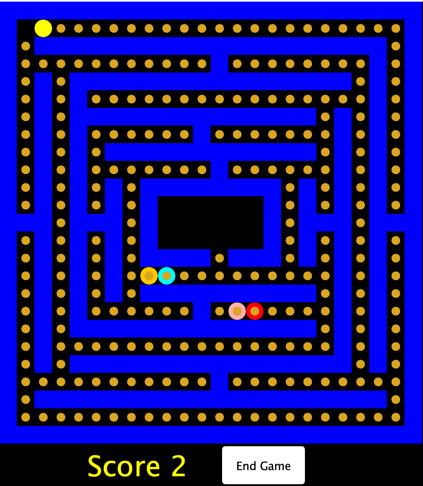

# Project 1: PacMan

## Table of Contents
- [Team members](#team-members)
- [Image of Game Play](#image-of-game-play)
- [How to Start Game](#how-to-start-game-from-bash-command-line)
- [API](#api-of-implemented-features)
   * [PacMan Class](#pacman-class) 
      + [get_valid_moves()](#get_valid_moves)
      + [move()](#move)
      + [is_ghost_in_range()](#is_ghost_in_range)
      + [consume()](#consume)
   * [Ghost Class](#ghost-class)
      + [get_valid_moves()](#get_valid_moves-1)
      + [move()](#move-1)
      + [is_pacman_in_range()](#is_pacman_in_range)
      + [attack()](#attack)
   * [Map Class](#map-class)
      + [move(String name, Location loc, Type type)](#move-string-name-location-loc-type-type)
      + [getLoc(Location loc)](#getloc-location-loc)
      + [attack(String name)](#attack-string-name)
      + [eatCookie(String Name)](#eatcookie-string-name)

## Team Members
* Daniel Kyung
* Lydia Hancock
* Ryan Shriver
* Shane Mehr

## Image of Game Play



## How to Start Game from Bash Command Line

```bash
javac -cp "src/" src/*.java
java -cp "src/" StartMenu
```

## API of Implemented Features

### PacMan Class

<!-- TEMPLTE FOR CODE DESCRIPTIONS
- **Type**: `(Location loc) -> HashSet<Type>`
- **Description**: 
- **Returns**: 
- **Example**:
  ```java
  //pacman and ghost at location (1,1)
  map.getLoc(new Location (1,1)) -> {Map.Type.PACMAN, Map.Type.GHOST}
  ```
- **Test Description**:
-->

#### get_valid_moves()  
- **Type**: `() -> ArrayList<Location>`
- **Description**: This function takes in no arguments and returns an arraylist of Locations that represent valid moves that Pacman is
  able to make given his current location. 
- **Returns**: `ArrayList<Location>` of possible valid moves (including diagonal movement). If there are no valid moves an empty arraylist is returned.
- **Example**: 
 ```java
  //pacman at location (9,11)
  pacman.get_valid_moves() -> {(9,12), (10,11), (10,12)}
  ```
- **Test Description**:  
  Pacman's valid moves include - moving into a Location with a COOKIE or a Location that is EMPTY. Testing
  included creating a map with different types (i.e. COOKIE, WALL, GHOST, EMPTY, PACMAN) and evaluating the
  returned arraylist when a call to this function was made.


#### move()
- **Type**: `() -> Bool`
- **Description**: uses the get_valid_moves method to find the possible locations that PacMan can move given his current location then moves PacMan to first location returned
- **Returns**: `true` if PacMan is able to move, `false` if get_valid_moves() returns an empty `HashSet<Type>` (i.e. PacMan is unable to move)
- **Example**:
  ```java
  //pacman at location (1,1)
  pacman.move() -> true
  pacman.myLoc ∈ {(1,2), (2,1), (2,2)}
  ```
- **Test Description**:
  
#### is_ghost_in_range()
- **Type**: `() -> Bool`
- **Description**: This method looks at all of PacMan's adjacent grid spaces (including diagonal grid spaces) and checks if a Ghost is present. If a Ghost is present in any adjacent grid space this method returns true, otherwise it returns false.
- **Examples**:
  ```java
  //ghost at location (9,11)
  //pacman at location (9,12)
  pacman.is_ghost_in_range() -> true
  ```

#### consume()
This function takes in no arguments and returns a Cookie component if pacman successfully eats a cookie. This method checks if cookie exists in pacman's             location, if true then returns a Map class method eatCookie(pacman name) which returns a component, otherwise returns null. 
   
   - JUnit TestConsume:
     This test checks if pacman is able to successfully able to consume a cookie in the pacman's location. After setting the cookie and pacman in the same location, the consume method should return the cookie component. 
   - JUnit TestNoCookie: 
      This test checks a return null if there is no cookie to consume for the pacman. 

### Ghost Class
#### get_valid_moves()  
- **Type**: `() -> ArrayList<Location>`
- **Description**: This function takes in no arguments and returns an arraylist of Locations that represent valid moves that a Ghost is
  able to make given their current location. 
- **Returns**: `ArrayList<Location>` of possible valid moves (including diagonal movement). If there are no valid moves an empty arraylist is returned.
- **Example**:
  ```java
  //ghost at location (9,11)
  ghost.get_valid_moves() -> {(9,12), (10,11), (10,12)}
  ```
- **Test Description**: <sup>*</sup>  
  A Ghost's valid moves include - moving into a Location with a COOKIE or a Location that is EMPTY or a Location 
  containing Pacman. Testing included creating a map with different types (i.e. COOKIE, WALL, GHOST, EMPTY, PACMAN) 
  and evaluating the returned arraylist when a call to this function was made.  
  
    <sup>*</sup>Note: Only one ghost can occupy any one Location at any given time. 

#### move()
- **Type**: `() -> Bool`
- **Description**: uses the get_valid_moves method to find the possible locations that Ghost can move given its current location then moves Ghost to first location returned
- **Returns**: `true` if PacMan is able to move, `false` if get_valid_moves() returns an empty `HashSet<Type>` (i.e. Ghost is unable to move)
- **Example**:
  ```java
  //ghost at location (1,1)
  ghost.move() -> true
  ghost.myLoc ∈ {(1,2), (2,1), (2,2)}
  ```
- **Test Description**:

#### is_pacman_in_range()
- **Type**: `() -> Bool`
- **Description**: This method looks at all of a Ghost's adjacent grid spaces (including diagonal grid spaces) and checks if PacMan is present. If PacMan is present in any adjacent grid space this method returns true, otherwise it returns false.
- **Examples**:
  ```java
  //ghost at location (9,11)
  //pacman at location (9,12)
  ghost.is_pacman_in_range() -> true
  ```

#### attack()
This function checks if a pacman is within the ghost's attack range using the is_pacman_in_range method that returns a boolean. If it returns true, then calls the attack method
from Map class, otherwise returns false. 

   - JUnit TestAttack: 
      This test sets up a pacman that is within a ghost's attack range,  which should return true for the method. 
   
   - JUnit TestUnsuccessfulAttack: 
      This test sets up a pacman outside of the ghost's attack range, which would return false for the method. 
      

### Map Class
#### move (String name, Location loc, Type type)  
- **Type**: `(String name, Location loc, Type type) -> Bool`
- **Description**: This function takes in three arguments: a String, a Location, and a Type. This moves the object specified by name (String)
  to the Location specified by loc. This a helper method to Pacman's
  and Ghost's move functions. 
- **Returns**: `true` if an object succesfully moved to its new location, and `false` otherwise. 
- **Example**:
   ```java
  //pacman at location (2,4)
  map.move("pacman", new Location (2,4), Map.Type.PACMAN) -> true
  ```
- **Test Description**:  
    JUnit test cases were created with the assumption that valid arguments will be passed in from Pacman's and Ghost's call 
      to this function. Testing included creating a map with different types (i.e. COOKIE, WALL, GHOST, EMPTY, PACMAN)
      and checking the accuracy of the return value when a call to this function is made.   


#### getLoc (Location loc)  
- **Type**: `(Location loc) -> HashSet<Type>`
- **Description**: returns Type of what is currently at the loc argument (Empty, Pacman, Cookie, Ghost, Wall)
- **Returns**: `HashSet<Type>` containing Type of all things at loc argument; a `HashSet<Type>` containing only `Map.Type.EMPTY` if nothing is at loc or containing only `Map.Type.WALL` if a wall is at loc
- **Example**:
  ```java
  //pacman and ghost at location (1,1)
  //wall and cookie at location (2, 1)
  map.getLoc(new Location (1,1)) -> {Map.Type.PACMAN, Map.Type.GHOST}
  map.getLoc(new Location (2,1)) -> {Map.Type.WALL}
  ```
- **Test Description**:

#### attack (String name)  
- **Type**: `(String name) -> Bool`
- **Description**: This method is called by the Ghost's attack method, meaning this method will only be called when PacMan is in range of a Ghost. When called this method will move the Ghost to PacMan's coordinates, then check to make sure both the Ghost and PacMan are positioned at the same grid space. If the Ghost and PacMan are at the same grid space the gameOver variable will be set to true, the display will be updated, and the method will return true. If the Ghost and PacMan are not at the same grid space this method will return false.
- **Examples**:
 ```java
  //ghost named clyde at location (9,11)
  //pacman at location (9,12)
  Map.attack("clyde") -> true
  ```

#### eatCookie (String Name)  
This method is called by the pacman object if a cookie is in pacman's location. If the pacman successfully consumes the cookie, it updates the map to show that the cookie has been consumed. 

   - JUnit TestMapEatCookie:
      This test sets up a cookie and pacman in same location and calls the eatCookie method which should return the cookie component. 
      
   - JUnit TestNoCookie: 
      This test sets up a cookie and pacman in different location and calls the eatCookie method which should return null. 
